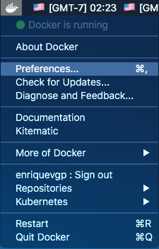
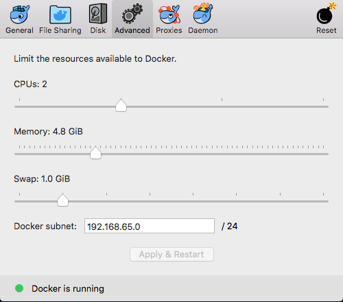

# OM Ansible

Minimalistic, disposable Ops Manager environment with Ansible.

## Table of contents

1. [Installation](#installtion)
1. [Usage with Docker](#docker)
1. [Usage with Vagrant](#vagrant)
1. [Infrastructure](#infrastructure)
1. [Additional features](#addedfeatures)
   1. [LDAP](#ldapconfig)
      * [Database users](#mongodbusers)
      * [Ops Manager Agents](#agentusers)
      * [Ops Manager users](#omusers)

## Installation <a name="installation"></a>

1. Create a local directory to use as home for OM Ansible and clone this repository into that directory:
   ```
   mkdir ~/om_ansible
   git clone https://github.com/HenryGP/om_ansible ~/om_ansible
   ```

**To use with Docker**

1. [Install Docker Compose](https://docs.docker.com/compose/install/)
1. **IMPORTANT!** Start the Docker UI and raise the memory limit to at least 4GB. This will avoid any issues with the Ops Manager server particularly. 
   - Click on the Docker icon at the topbar and select `Preferences`:
      
      
   - Select 'Advanced' and increase the memory limit to *at least* 4GB.
      
      
  - Click on 'Apply and restart'


**To use with Vagrant**
1. [Download and install Virtual Box](https://www.virtualbox.org/wiki/Downloads)
1. [Install Vagrant](https://www.vagrantup.com/docs/installation/)
1. [Install Ansible](https://docs.ansible.com/ansible/latest/installation_guide/intro_installation.html)

## Usage with Docker <a name="docker"></a>
1. Navigate to the directory used for om_ansible, in this case `~/om_ansible`:
   ```
   cd ~/om_ansible
   ```
1. Build the images for creating the infrastructure:
   ```
   docker-compose build
   ```
1. Create the containers:
   ```
   docker-compose up -d
   ```
1. Provision containers by executing general Ansible task:
   ```
   docker exec -it provisioner /opt/ansible-2.3.1.0/bin/ansible-playbook /root/om_ansible.yaml
   ```
1. Check the container names by executing `docker ps`
1. ssh into an specific container:
   ```
   docker exec -ti <container_name> /bin/bash
   ```
1. Pause/resume environment:
   ```
   docker-compose pause/unpause
   ```
1. Destroy the containers:
   ``` 
   docker-compose down
   ```

Access the following UIs using the web browser:
- Ops Manager UI: http://localhost:8080
   - User: admin
   - Password: Password1!
- S3 minio UI: http://localhost:9000
   - Credentials will be provided by Ansible when provisioning.

## Usage with Vagrant <a name="vagrant"></a>
1. Navigate to the directory used for om_ansible, in this case `~/om_ansible`:
   ```
   cd ~/om_ansible
   ```
1. Create the Virtual Machines using vagrant:
   ```
   vagrant up
   ```
   - Optionally you can startup individual virtual machines:
     ```
     vagrant up opsmgr
     ```
1. Set the variable `vms` in _vars/om-install-vars.yaml_ to `true`.
1. Provision the started Virtual Machine:
   ```
   vagrant provision <vm_name>
   ```
1. ssh into the instance:
   ```
   vagrant ssh <vm_name>
   ```
1. Pause environment:
   ```
   vagrant suspend
   ```
1. Destroy environment:
   ```
   vagrant destroy
   ```

Access the following UIs using the web browser:
- Ops Manager UI: http://192.168.1.100:8080
   - User: admin
   - Password: Password1!
- S3 minio UI: http://192.168.1.103:9000
   - Credentials will be provided by Ansible when provisioning.

## Infrastructure <a name="infrastructure"></a>

The default infrastructure consists of the following:

|Host|IP address|Role|
|-|-|-|
|omserver|192.168.1.100|Ops Manager server + Application DB|
|n\[1-2\]|192.168.1.10\[1-2\]|client with Automation installed|
|bkp|192.168.1.103|S3 storage|  
|provisioner*|192.168.1.99|Ansible provisioner|
|ldapserver*|192.168.1.104|OpenLDAP server|

\* only available if using Docker

## Additional features <a name="addedfeatures"></a>

The following section covers all additional features provided by om_ansible configurable once the environment is provisioned.

### LDAP <a name="ldapconfig"></a>

When using Docker, om_ansible will provision an additional container with an LDAP server ready to be used with Ops Manager or any of the managed deployments.

#### MongoDB database users <a name="mongodbusers"></a>
|User|MemberOf|
|-|-|
|uid=dba,ou=dbUsers,dc=tsdocker,dc=com|cn=dbAdmin,ou=dbRoles,dc=tsdocker,dc=com|
|uid=writer,ou=dbUsers,dc=tsdocker,dc=com|cn=readWriteAnyDatabase,ou=dbRoles,dc=tsdocker,dc=com|
|uid=reader,ou=DbUsers,dc=tsdocker,dc=com|cn=read,ou=dbRoles,dc=tsdocker,dc=com|

#### Ops Manager Agents <a name="agentusers"></a>
|User|MemberOf|
|-|-|
|uid=mms-automation,ou=dbUsers,dc=tsdocker,dc=com|cn=automation,ou=dbRoles,dc=tsdocker,dc=com|
|uid=mms-monitoring,ou=dbUsers,dc=tsdocker,dc=com|cn=monitoring,ou=dbRoles,dc=tsdocker,dc=com|
|uid=mms-backup,ou=dbUsers,dc=tsdocker,dc=com|cn=backup,ou=dbRoles,dc=tsdocker,dc=com|

#### Ops Manager users <a name="omusers"></a>
|User|MemberOf|
|-|-|
|uid=owner,ou=omusers,dc=tsdocker,dc=com|cn=owners,ou=omgroups,dc=tsdocker,dc=com|
|uid=reader,ou=omusers,dc=tsdocker,dc=com|cn=readers,ou=omgroups,dc=tsdocker,dc=com|
|uid=admin,ou=omusers,dc=tsdocker,dc=com|cn=owners,ou=omgroups,dc=tsdocker,dc=com|